# Neuro-Nav

<div align="center">

<h3>The Mobility Foundation for Vision-Language-Action (VLA) Models</h3>

<p>
    <b>"The Legs for your VLA."</b> <br>
    Focus on your manipulation policies. Let us handle the navigation.
</p>

[](https://docs.ros.org/)
[](https://developer.nvidia.com/isaac-sim)
[](https://www.python.org/)
[](https://opensource.org/licenses/Apache-2.0)

</div>

---

## 🚀 The Mission

**Embodied AI is shifting from "Navigation" to "Interaction".**

Top-tier AI researchers are building incredible Vision-Language-Action (VLA) models (like RT-2, $\pi_0$) that can fold laundry or cook meals. But these models often lack a robust "body" to move them between tasks.

**Neuro-Nav** is an open-source **Mobility-as-a-Service** stack designed specifically for VLA agents. It abstracts away the complexity of ROS 2, SLAM, and Path Planning, providing a simple, semantic API for upper-body agents.

> **Pain Point Solved:** Don't waste time debugging ROS navigation stacks or tuning PID controllers. Just tell Neuro-Nav: *"Position me to grasp that cup."*

## 🌟 Key Features

### 1. Manipulation-Aware Navigation (The "Stance")
Traditional navigation stops when the robot is "close enough." Neuro-Nav calculates the **Optimal Manipulation Stance**—positioning the robot base exactly where the arm's workspace covers the target object, ensuring high success rates for grasping.

### 2. Semantic API (No ROS Required)
Forget `ActionServers` and `Quaternions`. Control the base with high-level Python commands:
```python
from neuro_nav import MobilityAgent

agent = MobilityAgent()
# The robot autonomously maps, plans, and aligns for manipulation
agent.go_to(object="coffee_machine", intent="grasping")
```

### 3. Robust Auto-Recovery
Powered by VLM (Vision-Language Models), Neuro-Nav can "re-localize" itself using visual landmarks if the geometric SLAM fails. It provides the robustness needed for long-horizon tasks.

## 🏗 System Architecture
Neuro-Nav bridges the gap between high-level AI reasoning and low-level control.

```mermaid
graph TD
    subgraph User_Layer ["User / VLA Agent"]
        style User_Layer fill:#f3e5f5,stroke:#7b1fa2
        VLA_Model["Your VLA Model (e.g., π0, RT-2)"]
        SDK["Neuro-Nav Python SDK"]
    end

    subgraph Neuro_Nav_Core ["Neuro-Nav Core (The Black Box)"]
        style Neuro_Nav_Core fill:#e3f2fd,stroke:#1565c0
        Semantic_Engine["Semantic Engine (Florence-2 + LLM)"]
        Stance_Gen["Manipulation Stance Generator"]
        Nav_Stack["Robust Nav Stack (ROS 2 + SLAM)"]
    end

    subgraph Hardware ["Physical / Sim Layer"]
        Isaac["NVIDIA Isaac Sim / Real Robot"]
    end

    %% Flow
    VLA_Model -->|1. 'Go grasp the cup'| SDK
    SDK -->|2. Semantic Goal| Semantic_Engine
    Semantic_Engine -->|3. Object Location| Stance_Gen
    Stance_Gen -->|4. Optimal Base Pose x,y,theta| Nav_Stack
    Nav_Stack -->|5. cmd_vel| Isaac
    Isaac -->|6. Odom & Sensor Data| Nav_Stack
```



## 📂 Project Structure
```plaintext
neuro-nav/
├── neuro_nav_sdk/           # Python SDK for VLA developers (pip installable)
├── neuro_nav_sim/           # Auto-configured Isaac Sim environments
├── neuro_nav_stack/         # The underlying ROS 2 navigation & SLAM core
├── neuro_nav_brain/         # VLM integration & Stance generation logic
└── README.md
```

## 🗺️ Roadmap to v1.0

### Phase 1: The "Out-of-the-Box" Base (Current)
- [x] Repo initialization.
- [ ] One-Click Sim: Python script to launch Isaac Sim + ROS 2 bridge automatically.
- [ ] Standard Nav: Robust geometric point-to-point navigation (SLAM + Nav2).

### Phase 2: The Semantic Interface
- [ ] VLM Integration: Integrate Florence-2 for open-vocabulary object detection.
- [ ] SDK v0.1: Release the first Python wrapper agent.go_to("object").

### Phase 3: The "Stance" (Killer Feature)
- [ ] Inverse Kinematics Awareness: Calculate base pose based on arm reachability.
- [ ] Precision Docking: Fine-tuning base movement for interaction.

## 🤝 Contribution
We are building the infrastructure for the next generation of General Purpose Robots. If you are an expert in ROS 2 Navigation, Inverse Kinematics, or VLM integration, join us!